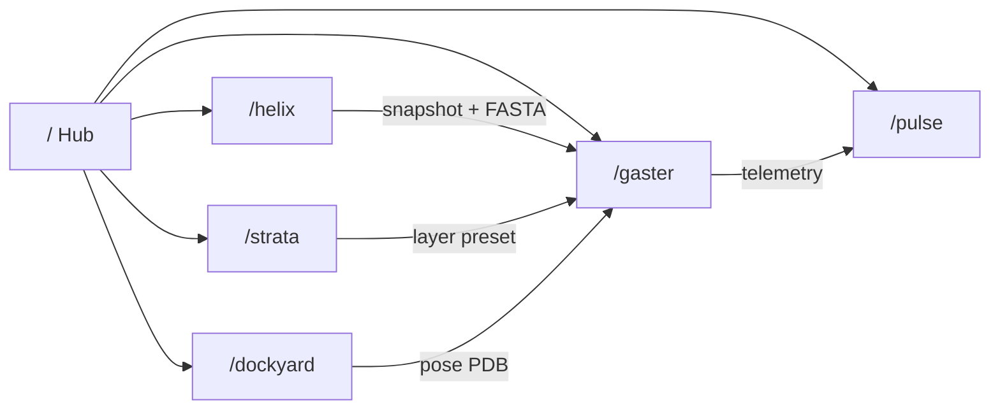

# Biolabs Tool Expansion — UX / UI Design Spec

> **Identity lock:** Dark industrial scientific workstation. Zero radius. Accent `#7C8A99` (dark) / `#5A6878` (light). Inter + Geist Mono. Uppercase kickers at 9–10px. 1px `border-border` panels. No gradients, no glassmorphism, no consumer SaaS chrome.

## Platform model

```
/                     Landing hub (tool registry)
/gaster               Gaster — protein prediction visualization  [LIVE]
/helix                Helix — sequence & variant lab            [BETA]
/strata               Strata — layer composer                   [BETA]
/dockyard             Dockyard — docking prep                   [SOON]
/pulse                Pulse — scientific metrics HUD            [SOON]
```

Each tool reuses the **workstation shell** (`workstation-shell` + dock preset). Landing stays the only marketing surface; tools are utilitarian.

---

## Tool proposals

### 1. Gaster `/gaster` (existing — reference)

| Field | Value |
|-------|--------|
| Tagline | Protein prediction visualization |
| Primary job | Load AlphaFold / PDB / UniProt → inspect 3D structure |
| Shell | Data · Viewport · Inspector (current dock) |
| Handoff out | Snapshot JSON, residue pick → Helix |

### 2. Helix `/helix` — Sequence & variant lab

| Field | Value |
|-------|--------|
| Tagline | Sequence editing & variant design |
| Primary job | FASTA ingest, point mutations, codon table, diff vs reference |
| Shell | **Input · Sequence strip · Variant inspector** (reuse `PolymerSequencePort` patterns) |
| Handoff | “Open in Gaster” with selection + mutated FASTA in snapshot |
| Local-first | No training; optional local ESMFold/Ollama hook later |

**Key panels:** Source (UniProt/FASTA) · dual polymer sequence dock · variant table (pos, ref, alt, BLOSUM hint mock).

### 3. Strata `/strata` — Layer composer

| Field | Value |
|-------|--------|
| Tagline | Multi-structure layer system |
| Primary job | Stack multiple structures, opacity, blend, visibility timeline |
| Shell | **Layers · Viewport · Properties** (extends existing `LayerSystem.tsx`) |
| Handoff | Export layer preset → Gaster overlay |

**Differentiator:** Matches landing “Photoshop-like layers” promise without bloating Gaster.

### 4. Dockyard `/dockyard` — Docking prep

| Field | Value |
|-------|--------|
| Tagline | Receptor–ligand pose workspace |
| Primary job | Define binding site, load poses, score table (local Vina stub / CSV import) |
| Shell | **Library · Viewport · Scores** |
| Handoff | Best pose → Gaster as second component |

**Note:** UI-first; backend can stay mock until local AutoDock Vina wrapper exists.

### 5. Pulse `/pulse` — Scientific metrics HUD

| Field | Value |
|-------|--------|
| Tagline | Live viewport telemetry |
| Primary job | FPS, atom count, selection stats, session log, CSV export |
| Shell | **Metrics grid · Mini viewport · Event log** (extends `ScientificHUD.tsx`) |
| Handoff | Read-only mirror of active Gaster session via shared context bus |

---

## Landing hub redesign (Pencil frames)

### Frame A — `Landing / Hub / 1440`

```
┌──────────────────────────────────────────────────────────────┐
│ [□] BIOLABS                              [Theme ▼] [⌘K hint] │  h=72, border-b
├──────────────────────────────────────────────────────────────┤
│                                                              │
│     Next-Generation Bio Simulation          (H1, tracking)   │
│     Platform subtitle — mono muted 14px                      │
│                                                              │
│     TOOLS  (kicker 9px uppercase tracking 0.14em)            │
│     ┌─────────────────────┐ ┌─────────────────────┐        │
│     │ Gaster      /gaster   │ │ Helix       /helix  │ LIVE   │
│     │ PROTEIN PREDICTION…   │ │ SEQUENCE & VARIANT… │ BETA   │
│     └─────────────────────┘ └─────────────────────┘        │
│     ┌─────────────────────┐ ┌─────────────────────┐        │
│     │ Strata      /strata │ │ Dockyard  /dockyard │        │
│     │ LAYER COMPOSER…     │ │ DOCKING PREP…       │ SOON   │
│     └─────────────────────┘ └─────────────────────┘        │
│     ┌─────────────────────┐                                  │
│     │ Pulse       /pulse  │                                  │
│     │ METRICS HUD…        │ SOON                           │
│     └─────────────────────┘                                  │
│                                                              │
│     CORE CAPABILITIES (existing 4-up grid, unchanged)        │
└──────────────────────────────────────────────────────────────┘
```

### Tool card component (reuse everywhere)

| Token | Spec |
|-------|------|
| Container | `bg-card`, `border border-border`, `p-16`, hover `border-accent` |
| Name row | Icon 18px accent + `text-sm font-medium` + route pill `font-mono 9px` |
| Tagline | `font-mono 10px uppercase tracking-wider text-accent` |
| Body | `text-xs text-muted-foreground` max 2 lines |
| Status pill | LIVE=`border-accent text-accent`, BETA=`border-border`, SOON=`opacity-50` |
| Radius | **0** |

### Frame B — `Tool / Helix / 1440` (beta shell)

Same chrome as Gaster: `AppHeader` + optional loaded strip + dock三列.

| Column | Width | Content |
|--------|-------|---------|
| Input | 280px | FASTA / UniProt (reuse `ProteinSourcePanel` layout) |
| Center | flex | Sequence strip + variant diff highlight |
| Inspector | 320px | Variant table, codon, “Send to Gaster” CTA |

CTA button: `border border-accent text-accent` → primary action pattern from landing hero.

### Frame C — `Tool / Strata / 1440`

| Column | Content |
|--------|---------|
| Layers | `LayerSystem` list, drag handle, eye toggle |
| Viewport | Shared NGL stage |
| Properties | Opacity slider, blend mode select, export preset |

---

## Information architecture



---

## Implementation phases

| Phase | Scope |
|-------|--------|
| P0 | Landing grid + route constants + SOON cards (no navigation) |
| P1 | Helix shell + FASTA panel + Gaster handoff |
| P2 | Strata layer UI wired to `LayerSystem` |
| P3 | Dockyard + Pulse |

---

## Pencil.dev checklist

1. Create `design/pencil/biolabs-tool-hub.pen` in repo root.
2. Add color variables matching `client/src/index.css` (`background`, `accent`, `border`).
3. Build components: `ToolCard`, `RoutePill`, `StatusBadge`, `AppHeader`, `DockColumn`.
4. Frames: Landing Hub, Gaster (reference screenshot), Helix, Strata.
5. Export PNG @2x for PR review; keep `.pen` in repo for iteration.

**Typography in Pencil:** Inter 13px body, Geist Mono 10px labels, letter-spacing +0.14em on kickers.
